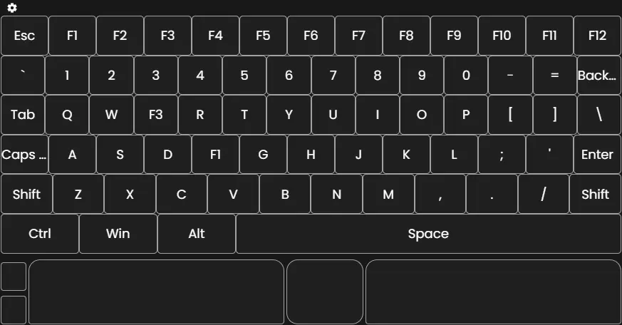

# **KyM Overlay: Keyboard & Mouse Visualizer**

KyM Overlay es una aplicación que muestra un **teclado y ratón en pantalla** que resalta visualmente las interacciones del usuario, ideal para **creadores de contenido, streamers o instructores**. Personaliza el aspecto, comportamiento y visibilidad del teclado y mouse según tus necesidades.

---

## **Tabla de Contenidos**

- [Características](#características)
- [Instalación](#instalación)
- [Uso](#uso)
- [Demostración](#demostración)
- [Soporte](#soporte)
- [Licencia](#licencia)

---

## **Características**

- 🎯 **Resaltado de Entradas:** Visualiza los clics y las teclas presionadas en tiempo real.
- ✏️ **Personalizable:** Edita y elimina teclas, ajusta colores, texto, y resaltados.
- ⚙️ **Control de Opacidad:** Configura la visibilidad del teclado y el ratón por separado.
- 👁️ **Mostrar/Ocultar:** Alterna fácilmente la visibilidad del teclado y mouse.

---

## **Instalación**

1. **Descarga** la aplicación desde el siguiente enlace:  
   [Download KyM Overlay](./public/downloadable/KyM_Overlay-setup.zip)

2. **Requisitos del Sistema:**

   - Sistema operativo: Windows 64-bit.

3. **Instrucciones de Instalación:**
   - Descomprime el archivo `.zip`.
   - Ejecuta el instalador `KyM_Overlay-setup.exe` y sigue las instrucciones.

---

## **Uso**

1. **Inicia la aplicación** desde el acceso directo generado.
2. Ajusta las opciones de teclado y ratón desde el menú de configuración:
   - **Modificar teclas y colores.**
   - **Activar/Desactivar resaltados.**
   - **Controlar la opacidad del overlay.**
3. Cambia entre **teclado y ratón visible/invisible** según lo necesites.

---

## **Demostración**

> Haz clic en la imagen para ver el video.

---

## **Soporte**

Si tienes alguna pregunta o necesitas ayuda, no dudes en contactar. federpena22@gmail.com
